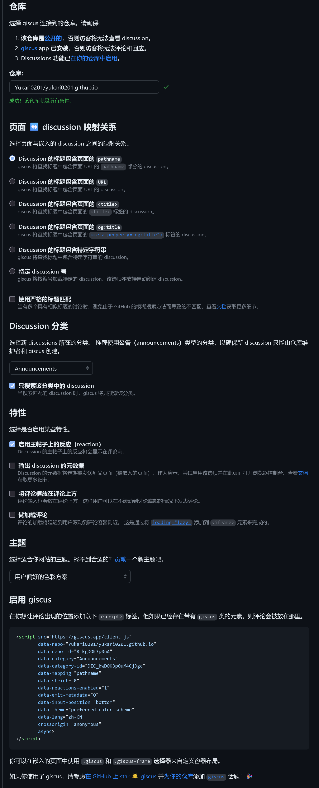

## 前言

本人最近将博客从 Hexo + NexT 迁移到了 Astro + Fuwari，期间评论系统的迁移花费了一番功夫，故写此文。

同我那篇 [为个人博客添加 Giscus 评论系统](https://yukari0201.github.io/posts/add-giscus-comment-system-to-blog-hexo-next-theme/) 一样，本文只会教你如何在 Astro + Fuwari 下使用 Astro 评论系统，高级用法请各位参考官方文档：https://github.com/giscus/giscus/blob/main/ADVANCED-USAGE.md

## 你需要准备的

- 首先，也是前提，一个爱折腾的心
- 一个顺畅的网络环境
- 一个 Astro + Fuwari 的博客
  - 如果你没有，请参考：https://github.com/saicaca/fuwari/tree/main?tab=readme-ov-file#-getting-started
- 一个 GitHub 仓库
- ... 好像就这么多（？

## 让我们开始叭

### 为 Github 仓库安装 Giscus app

> [!WARNING]
> 请参考我在 Hexo + NexT 时的配置步骤

这一步没什么好说的，完全一样，故不再赘述

### 为 Astro + Fuwari 博客添加 Giscus 评论系统

> [!NOTE]
> 此部分内容大多复制自 [Fuwari 官方仓库的 `comments` 分支](https://github.com/saicaca/fuwari/tree/comments) 和 [GitHUb@hikaru-im 的 Fork 的 `comments` 分支](https://github.com/hikaru-im/akari/tree/comments)  
> 特此鸣谢

~~碎碎念：  
Fuwari 官方 comments 分支的 Giscus 样式不是很好看，所以我选用了 [PR #405](https://github.com/saicaca/fuwari/pull/405) 的 Fork 版本  
如果你之前使用的是官方仓库的 comments 分支，可能会感觉有点不同~~

首先，在你的博客根目录执行如下命令
```
pnpm install @giscus/svelte
```

然后，下载此仓库 `comments` 分支的文件（切换分支并点击 `Code` 按钮，然后点击 `Download ZIP` 即可），并解压到你能找的的目录

::github{repo="hikaru-im/akari"}

接下来，复制下列文件到你的博客的对应位置

```
akari-comments/
└── src/
    ├── components/
    │   └── comment/
    │       ├── Giscus.svelte
    │       └── index.astro
    └── styles/
        ├── giscus-base.css
        ├── giscus-dark.css
        └── giscus-light.css
```

并更改 `/src/components/comment/index.astro` 最后几行的内容为：
```astro
let commentService = "";
if (commentConfig?.giscus) {
	commentService = "giscus";
}
---
<div class="card-base p-6 mb-4">
  {commentService === 'giscus' && <Giscus client:only="svelte" />}
  {commentService === '' && null}
</div>

```

然后，更改一些文件，让评论系统显示

你可以参考这两个链接：
- https://github.com/saicaca/fuwari/compare/main...comments
- https://github.com/saicaca/fuwari/compare/comments...hikaru-im:akari:comments

当然，为了各位着想，我也会列出具体需要修改的文件

`/tsconfig.json`  
在 `"paths"` 中添加：`"@styles/*": ["src/styles/*"],`
```json
    "paths": {
      "@components/*": ["src/components/*"],
      "@assets/*": ["src/assets/*"],
      "@constants/*": ["src/constants/*"],
      "@utils/*": ["src/utils/*"],
      "@i18n/*": ["src/i18n/*"],
      "@layouts/*": ["src/layouts/*"],
      "@styles/*": ["src/styles/*"],
      "@/*": ["src/*"]
    }
```

> [!WARNING]
> 注意：`//` 开头的是注释，无需添加！

`src/pages/posts/[...slug].astro`  
开头 `---` 之后添加：
```astro
import Comment from "@components/comment/index.astro";
```
最后一个 `<div>` 前添加：
```astro
    <Comment post={entry}></Comment>
```

`/src/types/config.ts`
```typescript
// 开头添加
import type * as Giscus from "@giscus/svelte";

// 末尾添加
export type CommentConfig = {
	giscus?: GiscusConfig;
};

type GiscusConfig = {
	repo: Giscus.Repo;
	host?: string;
	repoId: string;
	category: string;
	categoryId: string;
	mapping?: Giscus.Mapping;
	term?: string;
	strict?: Giscus.BooleanString;
	reactionsEnabled?: Giscus.BooleanString;
	emitMetadata?: Giscus.BooleanString;
	inputPosition?: Giscus.InputPosition;
	theme?: Giscus.Theme;
	lang?: Giscus.AvailableLanguage;
	loading?: Giscus.Loading;
};
```

配置：  
`/src/config.ts`
```typescript
// 开头更改（只需要添加 CommentConfig, 即可）
import type {
	CommentConfig,
	ExpressiveCodeConfig,
	LicenseConfig,
	NavBarConfig,
	ProfileConfig,
	SiteConfig,
} from "./types/config";

// 末尾添加并更改
// 你应该参考 https://giscus.app/ 生成的配置进行修改
export const commentConfig: CommentConfig = {
	giscus: {
		repo: "Yukari0201/Yukari0201.github.io",
		repoId: "R_kgDOK3p0uA",
		category: "Announcements",
		categoryId: "DIC_kwDOK3p0uM4CjDgc",
		mapping: "pathname",
		strict: "0",
		reactionsEnabled: "1",
		emitMetadata: "1",
		inputPosition: "top",
		theme: "reactive",
		lang: "zh-CN",
		loading: "lazy",
	},
};
```

这一步，你需要访问 https://giscus.app/ ，根据网站生成的配置自行修改，具体步骤相信各位都能看懂，我就直接复制了（~~懒~~

> 访问 https://giscus.app ，在 `仓库：` 部分输入 `<你的 Github 用户名>/<你存储评论的仓库名>`  
> 并在 `Discussion 分类` 部分选择一个 Discussion 分类（推荐 `Announcements` 分类，以确保新 discussion 只能由仓库维护者和 giscus 创建）  
> ~~提示：在 `主题` 部分可以选择评论系统的配色方案，对于 NexT 的深色主题，我推荐 `noborder_gray`~~  
> 对于本文或 [GitHUb@hikaru-im 的 Fork 的 `comments` 分支](https://github.com/hikaru-im/akari/tree/comments)，此步是不必要的 



| `启用 giscus` 中 `<script>` 的属性 | 对应在 `/src/config.ts` 中的配置项 |
| --- | --- |
| `data-repo` | `repo` |
| `data-repo-id` | `repoId` |
| `data-category` | `category` |
| `data-category-id` | `categoryId` |

需要自行修改的就以上这些，最多再添加一个 `lang`

> [!NOTE]
> 如果你使用本文或 [GitHUb@hikaru-im 的 Fork 的 `comments` 分支](https://github.com/hikaru-im/akari/tree/comments)，请将 `theme` 设置为 `reactive` 以契合主题


## 大功告成！

你可以运行如下命令来测试一下：

```
pnpm run dev
```

点进文章界面，滑到最底下，应该就可以看到评论框了

确认无误后，即可部署了

## 碎碎念

你可以在 https://github.com/Yukari0201/Yukari0201.github.io 看到我的博客的所有源码，所以，放心评论叭

~~博客评论系统换了一套，结果还是没有人发评论（~~  
~~博客都迁移了一套，结果还是几乎没有人发评论（~~
